# BeCompliantEU

BeCompliantEU is a full-stack SaaS platform designed to help organizations manage and document compliance with EU regulations and security standards.

The platform provides tools for compliance assessments, evidence management, business asset registration, dependency mapping and progress tracking.

> **Final Examination Project — IT-Technologist, Zealand**

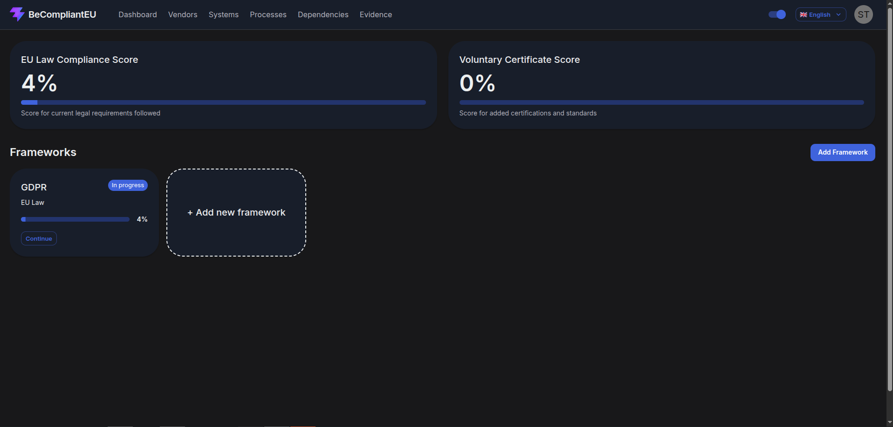

---

## About the Project

BeCompliantEU was developed as my final examination project during my IT-Technologist education at Zealand.

The goal was to create a practical compliance management platform that helps organizations understand their compliance requirements and keep track of their progress.

Organizations can add relevant compliance frameworks, complete structured assessments, identify compliance gaps and maintain documentation related to their systems, vendors and business processes.

The application currently includes support for frameworks such as:

- GDPR
- NIS2
- ISO 27001
- D-mærket

---

## My Role

BeCompliantEU was developed collaboratively as a team project.

My primary responsibility was **frontend development**, where I worked on building the user interface and connecting it to the backend through REST APIs.

My work included:

- Developing the frontend using React and TypeScript
- Building reusable UI components with Material UI
- Developing the dashboard and compliance assessment interface
- Building onboarding and framework selection flows
- Implementing vendor, system and business process management interfaces
- Developing dependency management between business assets
- Building evidence upload and overview functionality
- Integrating the frontend with REST APIs
- Implementing English and Danish localization
- Working with authentication and protected application functionality
- Collaborating on the overall frontend/backend architecture

---

## Key Features

### Compliance Dashboard

The dashboard provides an overview of the organization's current compliance status and separates legal compliance from voluntary certifications and standards.

Users can see their overall progress and continue working with individual compliance frameworks.


### Framework Assessments

Compliance frameworks are divided into sections and individual requirements.

Users can evaluate each requirement, add notes, attach evidence and continuously save their assessment progress.

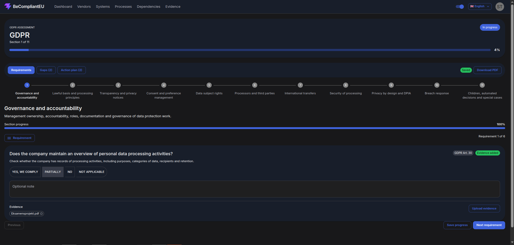

### Gaps & Action Plans

Requirements that are not fully satisfied can be identified as compliance gaps and presented as actionable items.

This provides organizations with an overview of areas requiring additional work.

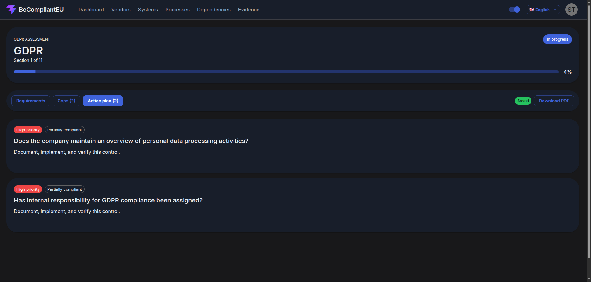

### Evidence Management

Evidence can be attached to individual compliance requirements and managed through a centralized evidence overview.

This allows documentation to remain connected to the requirement it supports.

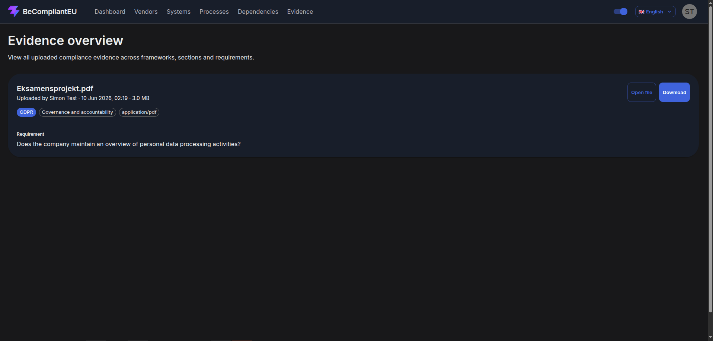

---

## Business Assets & Dependencies

BeCompliantEU also allows organizations to document important operational assets related to compliance.

### Vendors

External suppliers and service providers can be registered together with relevant compliance information such as DPA, SLA and security review status.

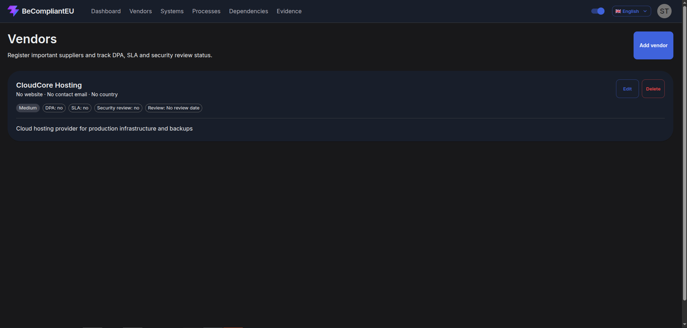

### Systems

Organizations can register IT systems and document information related to security, data processing, backups, monitoring and business continuity.

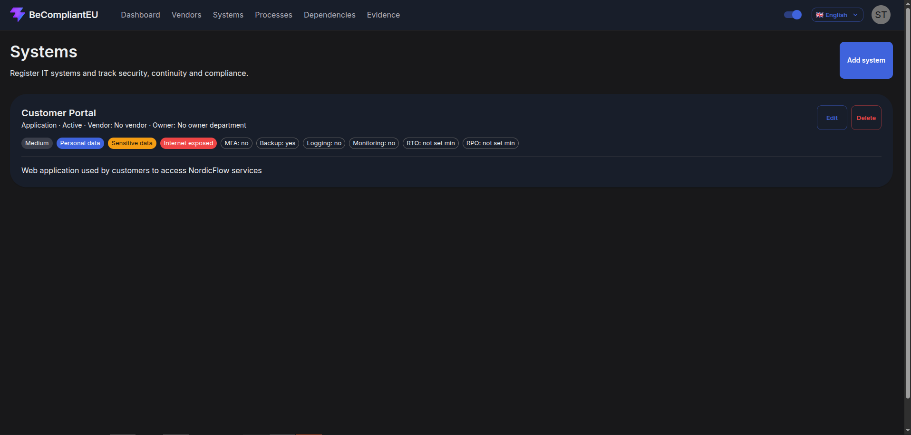

### Business Processes

Critical business processes can be documented together with information such as priority, maximum downtime and available manual workarounds.

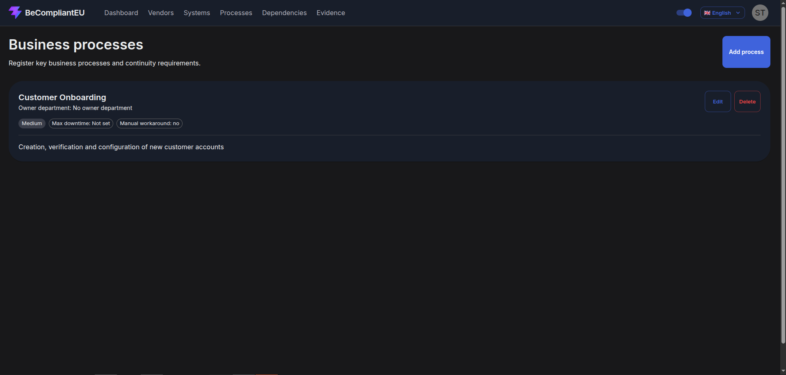

### Dependencies

Dependencies can be created between systems, vendors and business processes.

This makes it possible to document how important parts of an organization's infrastructure and operations depend on each other.

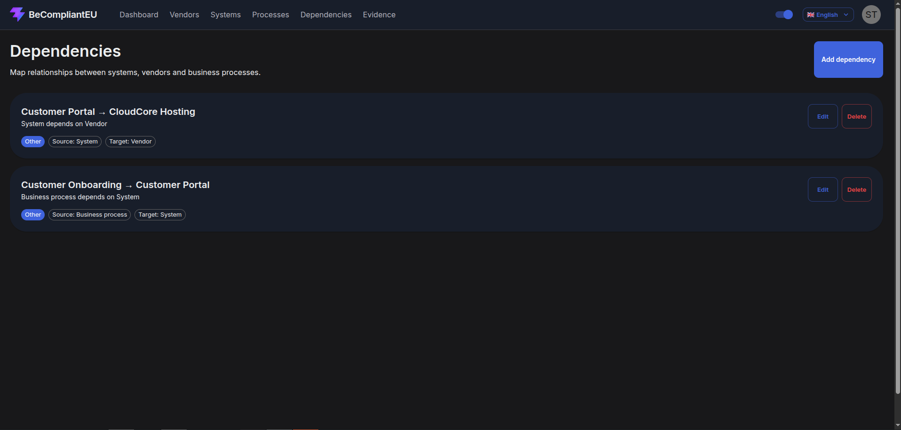

---

## Authentication & Access

The application includes authentication and protected functionality for registered organizations.

Users can sign in to access their organization's compliance environment.

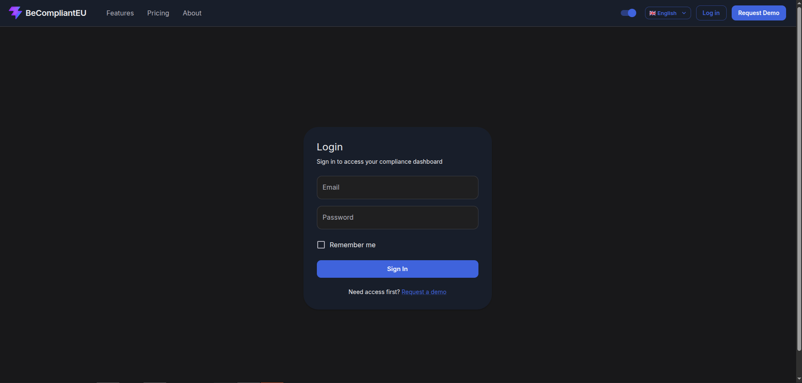

Organizations can also request access through the demo request flow.

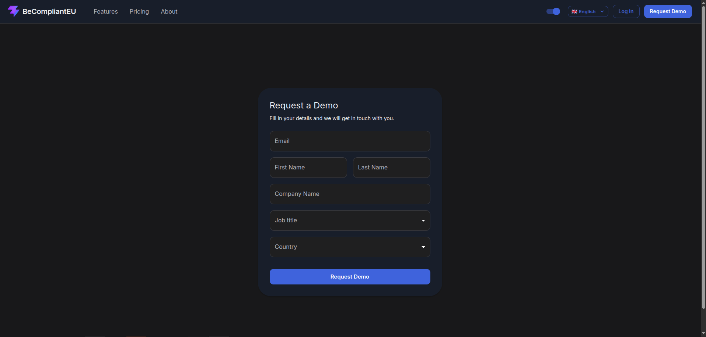

---

## Localization

The frontend supports both **English and Danish**, allowing users to switch language directly from the interface.

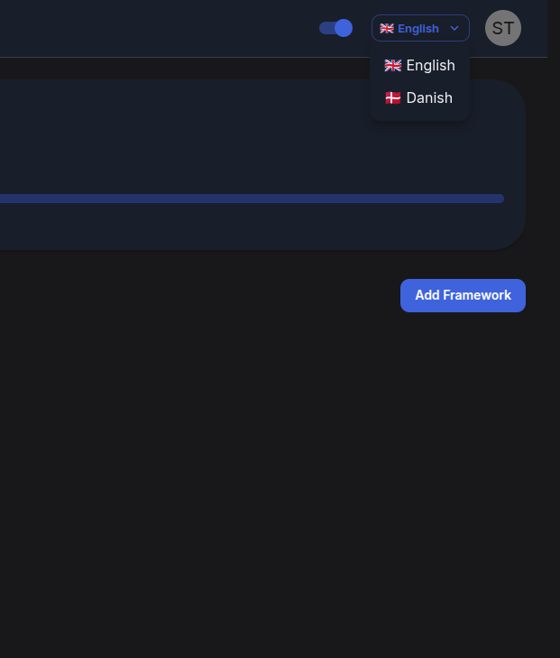

---

## Tech Stack

### Frontend

- React
- TypeScript
- Vite
- Material UI
- i18next / react-i18next

### Backend

- Node.js
- Express
- Prisma
- REST APIs

### Database

- SQL
- SQLite during development

### Development & Infrastructure

- Docker
- Docker Compose
- Git

---

## Architecture

BeCompliantEU follows a separated frontend and backend architecture.

```text
┌─────────────────────┐
│   React Frontend    │
│   TypeScript + MUI  │
└──────────┬──────────┘
           │
           │ REST API
           ▼
┌─────────────────────┐
│   Express Backend   │
│      Node.js        │
└──────────┬──────────┘
           │
           │ Prisma ORM
           ▼
┌─────────────────────┐
│      Database       │
└─────────────────────┘
```

The frontend communicates with the backend through REST APIs while the backend handles application logic and database access.

Docker is used to provide a consistent development environment for the frontend and backend services.

---

## What I Learned

Developing BeCompliantEU gave me practical experience working on a larger application where multiple parts of a software system have to work together.

The project strengthened my experience with:

- Structuring a larger React and TypeScript application
- Building reusable frontend components
- Integrating frontend applications with REST APIs
- Authentication and application state
- Designing interfaces for complex business data
- Working with relational data
- Docker-based development environments
- Git-based collaborative development
- Coordinating frontend and backend development

It also gave me experience translating complex compliance requirements into software that is easier for users to understand and work with.

---

## Project Status

BeCompliantEU was developed as a final examination project and remains a project that can be further expanded with additional compliance frameworks and functionality.

---

## Source Code

The source code for BeCompliantEU is kept private.

This repository serves as a **project showcase** and contains screenshots and technical information about the application.

Additional technical details can be provided upon request.
